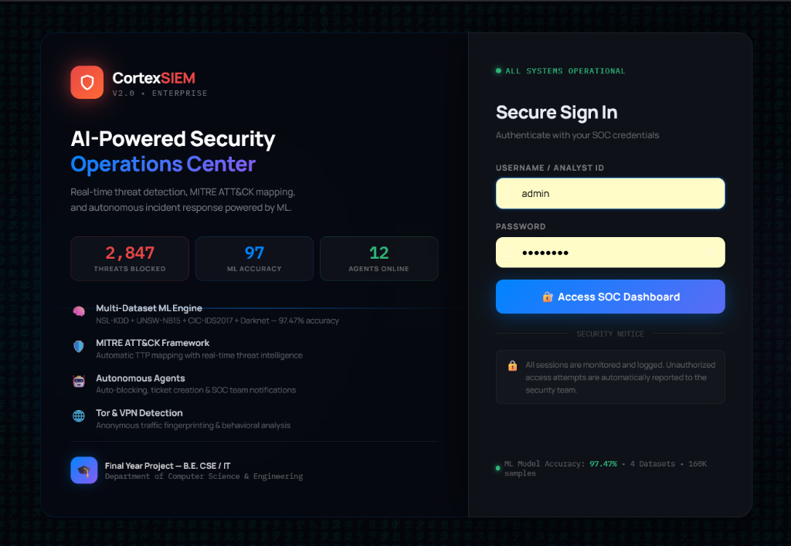
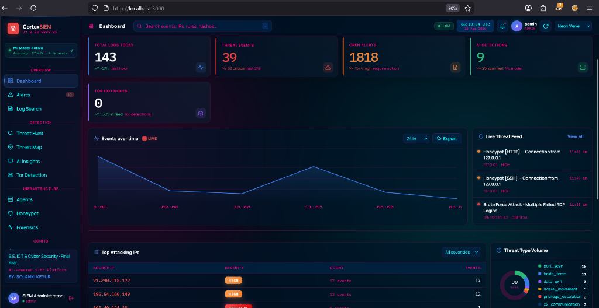

# 🛡️ AI-Powered SIEM Platform v3.0

<div align="center">


**A full-stack, AI-driven Security Information & Event Management platform with real-time threat detection, autonomous SOC agents, LLM-powered analysis, and live log ingestion.**

[Features](#-features) • [Architecture](#-architecture) • [Quick Start](#-quick-start) • [API Docs](#-api-endpoints) • [Screenshots](#-screenshots)

</div>

---

## ✨ Features

| Category | Capabilities |
|---|---|
| 🤖 **AI / LLM** | Groq (LLaMA-3.3-70B), OpenAI GPT-4, Gemini — auto-fallback routing |
| 🧠 **ML Detection** | Random Forest classifier trained on CICIDS2017/CIC-Darknet2020 datasets |
| 🕵️ **SOC Agents** | Autonomous Triage, Analyst, Responder, and Forensics agents |
| 📡 **Log Collection** | Winlogbeat (Windows), Syslog (Linux/Mac), REST API ingest |
| 🗺️ **Threat Map** | Real-time animated global attack map with country attribution |
| 🧅 **Tor Detection** | Live Tor exit-node feed with behavioral traffic analysis |
| 🍯 **Honeypot** | Deployable honeypot services with attacker capture & analysis |
| 🔍 **Threat Hunt** | Interactive threat hunting console with MITRE ATT&CK mapping |
| 🔬 **Forensics** | Log timeline reconstruction, artifact extraction, incident reports |
| 📊 **Dashboard** | Real-time WebSocket stats, anomaly alerts, sparklines, donut charts |
| 🔔 **Notifications** | Slack webhook alerts for critical threats |
| 📄 **Reports** | Auto-generated PDF/JSON incident response reports |

---

## 🏗️ Architecture

```
┌─────────────────────────────────────────────────────────────┐
│                     React SOC Dashboard                      │
│         (Vite + JSX · Real-time WebSocket · Themes)         │
└─────────────────────────┬───────────────────────────────────┘
                          │  HTTP / WebSocket
┌─────────────────────────▼───────────────────────────────────┐
│              FastAPI Backend  (port 8000)                    │
│  ┌──────────┐ ┌──────────┐ ┌──────────┐ ┌───────────────┐  │
│  │ Log API  │ │Alert API │ │Agent API │ │  Auth / JWT   │  │
│  └────┬─────┘ └────┬─────┘ └────┬─────┘ └───────────────┘  │
│       │             │             │                           │
│  ┌────▼─────────────▼─────────────▼──────────────────────┐  │
│  │           Ingestion Pipeline                           │  │
│  │  Log Parser → Rule Engine → Correlator → LLM Router   │  │
│  └────────────────────────┬───────────────────────────────┘  │
│                           │                                   │
│  ┌────────────────────────▼───────────────────────────────┐  │
│  │   AI Layer                                             │  │
│  │   ML Classifier (RF) · LLM Analysis · Anomaly Detect  │  │
│  └────────────────────────┬───────────────────────────────┘  │
└───────────────────────────┼─────────────────────────────────┘
                            │
              ┌─────────────▼──────────────┐
              │        MongoDB              │
              │  raw_logs · threat_logs    │
              │  alerts · agent_actions    │
              │  honeypot_captures · ...   │
              └────────────────────────────┘

Log Sources:  Winlogbeat (TCP:5044) · Syslog (UDP:514) · REST API
```

---

## 🗂️ Project Structure

```
ai-powered-siem/
├── backend/
│   ├── app/
│   │   ├── main.py                  ← FastAPI app + WebSocket
│   │   ├── config.py                ← Settings (reads .env)
│   │   ├── api/                     ← REST API routers
│   │   │   ├── logs.py              ← Log ingestion & query
│   │   │   ├── alerts.py            ← Alert management
│   │   │   ├── agents.py            ← Agent trigger API
│   │   │   ├── auth.py              ← JWT authentication
│   │   │   ├── forensics_api.py     ← Digital forensics
│   │   │   ├── honeypot_api.py      ← Honeypot control
│   │   │   ├── hunt_api.py          ← Threat hunting
│   │   │   ├── intel_api.py         ← Threat intelligence
│   │   │   ├── notification_api.py  ← Slack notifications
│   │   │   ├── report_api.py        ← Report generation
│   │   │   ├── rules_api.py         ← Detection rules CRUD
│   │   │   └── tor_api.py           ← Tor detection
│   │   ├── core/
│   │   │   ├── log_parser.py        ← Multi-source normalizer
│   │   │   ├── rule_engine.py       ← Sigma-style detection
│   │   │   ├── correlator.py        ← Multi-event correlation
│   │   │   ├── log_receiver.py      ← TCP/Syslog receiver
│   │   │   └── auth_middleware.py   ← JWT middleware
│   │   ├── database/
│   │   │   ├── db.py                ← MongoDB async client
│   │   │   └── indices.py           ← Index definitions
│   │   ├── pipeline/
│   │   │   └── ingestion_pipeline.py
│   │   ├── services/
│   │   │   ├── llm_service.py       ← LLM orchestration
│   │   │   ├── anomaly_detector.py  ← Statistical anomalies
│   │   │   ├── forensics.py         ← Forensic analysis
│   │   │   ├── honeypot.py          ← Honeypot engine
│   │   │   ├── threat_hunt_service.py
│   │   │   ├── threat_intel.py      ← AbuseIPDB integration
│   │   │   ├── tor_detection.py     ← Tor exit-node tracking
│   │   │   └── report_service.py    ← PDF/JSON reports
│   │   └── llm/
│   │       ├── router.py            ← Auto-switch LLM provider
│   │       ├── groq_client.py
│   │       ├── openai_client.py
│   │       └── gemini_client.py
│   └── requirements.txt
├── agents/
│   ├── soc_agent.py                 ← Triage agent
│   ├── analyst_agent.py             ← Investigation agent
│   ├── responder_agent.py           ← Response agent
│   ├── forensics_agent.py           ← Forensics agent
│   └── agent_manager.py             ← Orchestrator
├── ml_model/
│   ├── train_model.py               ← Single-dataset trainer
│   ├── train_multi_dataset.py       ← Multi-dataset trainer
│   ├── predictor.py                 ← Real-time ML inference
│   └── test_prediction.py           ← Model evaluation
├── siem_frontend/                   ← React SOC Dashboard
│   └── src/
│       ├── pages/                   ← Dashboard, Alerts, Logs ...
│       └── components/              ← Charts, Maps, UI widgets
├── scripts/
│   ├── simulate_attack.py           ← Full attack simulation suite
│   ├── honeypot_attack.py           ← Honeypot attack simulator
│   └── attack_honeypot.py
├── log_collection/
│   └── windows/winlogbeat.yml       ← Winlogbeat config
├── start_backend.bat                ← Windows quick start
├── start_frontend.bat
└── .env.example                     ← ← ← Copy this to .env
```

---

## ⚡ Quick Start

### Prerequisites

```bash
# Required
- Python 3.11+
- Node.js 18+
- MongoDB Community 7.0+  →  https://www.mongodb.com/try/download/community

# Start MongoDB (Windows)
net start MongoDB
```

### 1. Clone & Configure Environment

```bash
git clone https://github.com/YOUR_USERNAME/ai-powered-siem.git
cd ai-powered-siem

# Copy the example env file and fill in your keys
copy .env.example backend\.env
notepad backend\.env
```

### 2. Backend Setup

```bash
cd backend
pip install -r requirements.txt

# Start backend API
cd ..
start_backend.bat          # Windows
# OR manually:
cd backend && uvicorn app.main:app --reload --port 8000
```

### 3. Frontend Setup

```bash
cd siem_frontend
npm install
npm run dev
# Open http://localhost:5173
```

### 4. (Optional) Train the ML Model

```bash
# Place CICIDS2017 CSV files in the project root or dataset/ folder
python ml_model/train_multi_dataset.py
```

---

## 🔐 Environment Variables

Copy `.env.example` to `backend/.env` and fill in your values:

```env
# ── Database ─────────────────────────────────────
MONGODB_URL=mongodb://localhost:27017
MONGODB_DB_NAME=siem_db

# ── LLM Provider (choose one or more) ────────────
LLM_PROVIDER=groq                    # groq | openai | gemini | none
LLM_MODEL=llama-3.3-70b-versatile

GROQ_API_KEY=your_groq_api_key_here
OPENAI_API_KEY=your_openai_key_here   # optional
# GEMINI_API_KEY=                     # optional

# ── Threat Intelligence ───────────────────────────
ABUSEIPDB_API_KEY=your_abuseipdb_key_here   # optional

# ── Security ─────────────────────────────────────
SECRET_KEY=change-this-to-a-long-random-string-in-production
JWT_ALGORITHM=HS256
JWT_EXPIRE_MINUTES=1440

# ── Notifications (optional) ──────────────────────
SLACK_WEBHOOK_URL=https://hooks.slack.com/services/YOUR/SLACK/WEBHOOK
```

> **⚠️ Never commit your real `.env` file.** It is already in `.gitignore`.

---

## 📡 Winlogbeat Setup (Live Windows Log Collection)

```powershell
# Run PowerShell as Administrator
# Download from: https://www.elastic.co/downloads/beats/winlogbeat

# Copy config
Copy-Item log_collection\windows\winlogbeat.yml "C:\Program Files\Winlogbeat\winlogbeat.yml"

# Test & install
cd "C:\Program Files\Winlogbeat"
.\winlogbeat.exe test config -c winlogbeat.yml
.\install-service-winlogbeat.ps1
Start-Service winlogbeat
```

**Flow:**
```
Windows Event Log → Winlogbeat → POST /api/logs/ingest/raw
    → Log Parser → Rule Engine → Correlator → LLM → MongoDB → Alert
```

---

## 🧪 Attack Simulation (Testing Without Real Logs)

```bash
# Run full attack chain (brute force → lateral movement → data exfil)
python scripts/simulate_attack.py --attack full_chain

# Individual attack types
python scripts/simulate_attack.py --attack brute_force --count 20
python scripts/simulate_attack.py --attack port_scan
python scripts/simulate_attack.py --attack malware
python scripts/simulate_attack.py --attack ransomware
python scripts/simulate_attack.py --attack lateral_movement

# Honeypot attack simulation
python scripts/honeypot_attack.py
```

---

## 🔌 API Endpoints

| Method | Endpoint | Description |
|--------|----------|-------------|
| `POST` | `/api/logs/ingest/raw` | Winlogbeat / agent log ingest |
| `GET` | `/api/logs/` | Query raw logs |
| `GET` | `/api/logs/threats` | Query threat logs |
| `GET` | `/api/alerts/` | List alerts (filterable) |
| `GET` | `/api/alerts/summary` | Alert counts by severity |
| `POST` | `/api/alerts/{id}/investigate` | LLM deep-dive investigation |
| `POST` | `/api/agents/run/{alert_id}` | Run all AI agents on alert |
| `GET` | `/api/agents/actions` | Agent action history |
| `POST` | `/api/tor/check` | Check IP against Tor exit nodes |
| `GET` | `/api/honeypot/captures` | Honeypot attacker captures |
| `POST` | `/api/hunt/run` | Run threat hunt query |
| `GET` | `/api/forensics/{alert_id}` | Forensic analysis for alert |
| `GET` | `/api/intel/{ip}` | AbuseIPDB threat intel lookup |
| `GET` | `/api/dashboard` | Full dashboard statistics |
| `GET` | `/health` | System health check |
| `WS` | `/ws` | Real-time WebSocket stats feed |

> Full interactive docs available at `http://localhost:8000/docs` (Swagger UI)

---

## 🛡️ Detection Rules

| Rule | Event IDs / Trigger | Severity | MITRE ATT&CK |
|------|---------------------|----------|---------------|
| Brute Force | 4625, 4771, 4776 | 🔴 High | T1110 |
| Privilege Escalation | 4672, 4673, 4674 | 🔴 High | T1068 |
| Suspicious Process | 4688, Sysmon-1 | 🔴 High | T1059 |
| New User Created | 4720 | 🟡 Medium | T1136 |
| Audit Policy Changed | 4719, 4906 | 🟡 Medium | T1562 |
| Port Scan | Keyword pattern | 🟡 Medium | T1046 |
| Lateral Movement | 4624 Type 3/10 | 🔴 High | T1021 |
| Malware Keywords | Any source | 🟣 Critical | T1204 |
| Tor Exit Node | IP match | 🔴 High | T1090 |
| Data Exfiltration | Volume + dest | 🟣 Critical | T1041 |

---

## 🗄️ MongoDB Collections

| Collection | Description |
|------------|-------------|
| `raw_logs` | All ingested raw events |
| `threat_logs` | Detected threats with ML confidence scores |
| `alerts` | Generated alerts with LLM analysis |
| `agent_actions` | AI agent action audit trail |
| `anomalies` | Statistical anomaly detections |
| `honeypot_captures` | Attacker interactions with honeypots |
| `rules` | Custom detection rules |
| `users` | Authenticated SOC users |

---

## 📸 Screenshots

### 🔑 Secure Sign-In Portal
Highly secure, modern glassmorphism portal featuring real-time system status indicators, ML model metrics, and active threat counters.


### 🏠 Main SOC Dashboard
Comprehensive real-time overview displaying live threat feeds, log volumes, critical alerts, AI insights, top attacking IPs, and threat categorization charts.


---

## 📊 Dashboard Pages

| Page | Description |
|------|-------------|
| 🏠 Dashboard | Live stats, threat charts, recent alerts |
| 🚨 Alerts | Alert queue with LLM investigation |
| 📋 Logs | Searchable log explorer |
| 🤖 AI Insights | LLM summaries & anomaly reports |
| 🕵️ Agents | Autonomous agent control & history |
| 🗺️ Threat Map | Animated global attack origin map |
| 🧅 Tor Detection | Tor exit-node threat monitor |
| 🍯 Honeypot | Honeypot deploy & capture viewer |
| 🔍 Threat Hunt | MITRE ATT&CK hunt console |
| 🔬 Forensics | Incident timeline & artifact analysis |
| 📄 Reports | Export PDF/JSON security reports |

---

## 🚀 Production Checklist

- [ ] Change `SECRET_KEY` to a long random string in `.env`
- [ ] Enable MongoDB authentication (`mongod --auth`)
- [ ] Set `DEBUG=false` in `.env`
- [ ] Configure HTTPS with nginx reverse proxy
- [ ] Run backend with multiple workers: `uvicorn app.main:app --workers 4`
- [ ] Set up MongoDB automated backups (`mongodump`)
- [ ] Restrict CORS origins in `main.py` to your frontend domain
- [ ] Configure log retention: `LOG_RETENTION_DAYS=90`
- [ ] Run Winlogbeat with Administrator privileges

---

## 🧰 Tech Stack

**Backend:** Python 3.11 · FastAPI · Motor (async MongoDB) · Pydantic v2 · Loguru · PyJWT

**AI / ML:** scikit-learn · Groq API · OpenAI API · Google Gemini API

**Frontend:** React 18 · Vite · Recharts · Leaflet.js · Axios

**Infrastructure:** MongoDB 7 · Winlogbeat · Uvicorn · WebSockets

---

## 📄 License

This project is licensed under the **MIT License** — see [LICENSE](LICENSE) for details.

---

## 🙏 Acknowledgements

- [CICIDS2017 Dataset](https://www.unb.ca/cic/datasets/ids-2017.html) — Canadian Institute for Cybersecurity
- [CIC-Darknet2020](https://www.unb.ca/cic/datasets/darknet2020.html) — Network traffic dataset
- [MITRE ATT&CK Framework](https://attack.mitre.org/) — Threat classification
- [AbuseIPDB](https://www.abuseipdb.com/) — IP reputation intelligence

---

<div align="center">
Made with ❤️ for Cybersecurity Research
</div>
